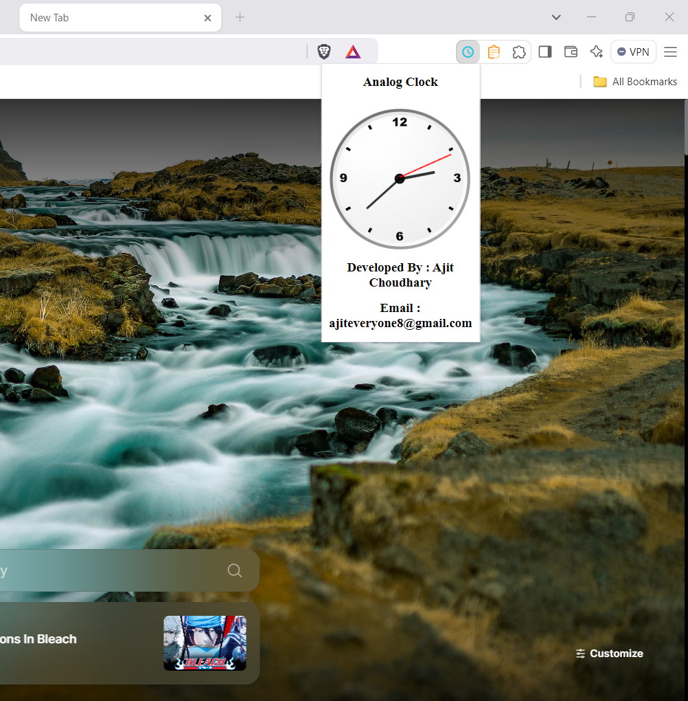

Analog Clock Chrome Extension

Summary:
This Chrome extension adds an analog clock to your browser toolbar, allowing you to easily view the time in a classic analog style. The clock updates in real-time, providing a simple and stylish timekeeping feature within your browser.

Features:
- Real-time analog clock display in the toolbar.
- Customizable clock design (e.g., colors, size) using style.css.
- Lightweight and simple to use.

Screenshot:
You can view the screenshot of the analog clock in the toolbar below:

How to Clone and Upload the Extension:

1. Clone the Repository:
   - Open your terminal/command prompt.
   - Navigate to the directory where you want to store the project.
   - Clone the repository using the following command:
     git clone [https://github.com/yourusername/analog-clock-extension.git](https://github.com/ajiteveryone8/chrome-extension-analog-clock)

2. Setup the Project:
   - Navigate to the project directory:
     cd analog-clock-extension
   - Open the project folder and make any necessary adjustments to the files (e.g., icon, style, etc.).

3. Load the Extension into Chrome:
   - Open Chrome and go to chrome://extensions/.
   - Enable "Developer mode" in the top right corner.
   - Click on "Load unpacked" and select the directory of your cloned extension.
   - The analog clock extension should now appear in the toolbar.

4. Upload the Extension to Chrome Web Store:
   - Go to the Chrome Web Store Developer Dashboard: https://chrome.google.com/webstore/developer/dashboard
   - Sign in with your Google account.
   - Click on "Add a new item" and upload a ZIP file of your extension's directory.
   - Fill in the required details (description, screenshots, etc.) and click "Publish."
   - After a review, your extension will be available on the Chrome Web Store.

Contact:
For support or contributions, feel free to reach out to ajiteveryone8@gmail.com.
